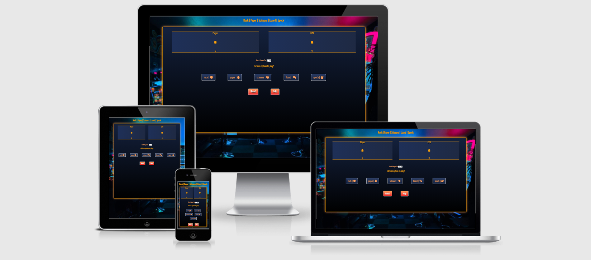

# Rock Paper Scissors Lizard Spock

## Introduction

The first known mention of the game of Rock Paper Scissors was in the book 'Wuzazu'. The game dates back to the time of the Chinese Han dynasty (206 BC – 220 AD). From then til now it has been adapted in different ways. This is one of those fun adaptations. My work will target those who aim to play a quick game with the element of chance and fans of the rock paper scissors lizard spock adaptation.

## UX

I have chosen to impliment a dark but vibrant design which imitates an arcade screen. The arcade image used in the background goes hand in hand with the tones of the styling and the glow of the borders to give the game a fun retro feel. I feel that in choosing these options I have a greater chance of grasping the users attention and retaining their interest.

## Exernal User Goal

The site user wants to play an online game that has the element of chance.

## User Stories

- As a user I should be able to understand the difference between each set option.
- As a user I should be able to find out how to play.
- As a user I should be abe to reset the game.
- As a user I should be able to choose the amount of game I want to play to.
- As a user I should be able to distinguise between rock, paper, scissors, lizard and spock.
- As a user I should be able to track my score.

## Site Owner Goal

The site goal is to provide a game to entertain online users.

### Colour Scheme

With the colour scheme I picked two colours that I felt complimented each other well on (https://coolors.co/). I also inspected the colors in my background image and selected a few that would blend in. I feel the neon orange partnered with the glow carrys forward the feeling that the user in an arcade.

### Typography

- I chose a Google font that I felt wasnt too professional and went along with the fun attention grasping theme I had in mind. The text is clear and easy to read and gives the buttons a smooth look.

- font-awesome - used the icons from font awesome for the rock, paper, scissors, lizard, and spock options as they were easy to identify.

### Wireframe

## Features 

### Existing Features

- [Ability to select number of games.](documentation/features/first-to.png)
- [Able to reset game.](documentation/features/reset.gif)
- [Able to select from a range of choices which affect the game.](documentation/features/button-selection.png)
- [Ability to find out the rules.](documentation/features/rules.png)
- [Ability to see what choices you and the computer pick.](documentation/features/score-section.png)

### Features Left to Implement

- Ability to play against others online.

## Technologies Used

 - HTML used for the markup text
 - CSS used for style
 - JS
 - GIT version control and commit messages
 - Gitpod 
 - GitHub used for the IDE
 - [invision](https://www.invisionapp.com/) To create wireframes.

## Testing 

- HTML validator
- CSS validator
- JsHint

### Buttons 

- Game buttons fully operational.
- Reset button fully operational. 
- Help button fully operational. 
- Buttons disabled after game win/loss.

### Code Validation

### Browser Compatibility

I have tested the site on:
- [Microsoft Edge](documentation/compatability/edge-compatability.jpg) 
- [Google Chrome](documentation/compatability/chrome-compatability.png) 
- [Firefox](documentation/compatability/firefox-compatability.jpg)

### Responsiveness

Using the developer tools on Google Chrome I tested my website's dimentions on iPhone 5/SE, iPhone X, iPad and the Pixel 2 on both landscape and portrait modes. 

On the iPhone 5/SE the site was not correctly scaled as seen [here](/workspace/rock-paper-scissors-lizard-spock/documentation/testing/responsiveness-error.png). I noted and fixed this issue by changing the css. The result can be seen [here](/workspace/rock-paper-scissors-lizard-spock/documentation/testing/responsiveness-fix.png).

### Testing User Stories

### Unfixed Bugs

- Currently there are no known bugs.

## Deployment

This site was deployed to GitHub pages. To deploy the project to GitHub Pages, follow these steps:
- navigate to the [repository](https://github.com/devisis/rock-paper-scissors-lizard-spock)
- from the Settings page, click on "Pages"
- select the **main** branch from the dropdown, and click "Save*
- the site is now deployed at [rpsls](https://devisis.github.io/rock-paper-scissors-lizard-spock/)

### Local Deployment

To make a local copy, you can type the following command in your IDE terminal:
- `git clone https://github.com/devisis/rock-paper-scissors-lizard-spock.git`

Alternatively, if you are using Gitpod, you can use this link:
- [Open in Gitpod](https://gitpod.io/#https://github.com/devisis/rock-paper-scissors-lizard-spock)

## Credits

### Media

- google fonts
- [pngwing](https://www.pngwing.com/)
- [unsplash](https://unsplash.com/)
- [fontawesome](https://fontawesome.com/)

### Acknowledgements
- Thank you to my mentor for help and support.
- Rules gathered from https://the-big-bang-theory.com/rock-paper-scissors-lizard-spock/
- Modal help found on https://www.w3schools.com/howto/howto_css_modals.asp